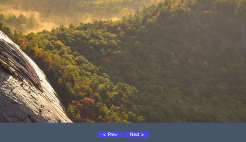

# Modules Images Slider for React v.1.0.0



ReactJS modules are simple but have many advantages, one of which is that you can customize them freely.

## NPM Installation

```sh
npm install hy-image-slider-react
```

## Example Project Implemented

```sh
// Add - Impport module //
import Slider from 'hy-image-slider-react';
//----//

const App = () => {
  return (
    <div>
    
      // Add - Default components //
      <Slider interval={1000} buttonTextPrev="Prev" buttonTextNext="Next" images={['banner-1.jpg', 'banner-1.jpg', 'banner-1.jpg']}/>
      //----//
      
    </div>
  );
};

export default App;
```

## Customization

| Atribute | Key | Description | Status |
|:--------------------------|:-----------|:-----------|:-----------|
| `images={key?}`           |`['banner-1.jpg', 'banner-1.jpg', 'banner-1.jpg']` |Insert image (local/url)                   |Required
| `interval={key?}`         |`500` `1000` `3000` etc...                         |Set interval time              |Required
| `width={key?}`            |`600` `1000` `1500` etc...                         |Set width (px)                 |Optional
| `height={key?}`           |`600` `1000` `1500` etc...                         |Set height (px)                |Optional
| `objectFit="key?"`        |`fill` `contain` `cover` `scale-down` `none`       |Set Image Object               |Optional
| `hoverStop={key?}`        |`true` `false`                                     |Image stops on hover           |Optional
| `borderRadius={key?}`     |`0` `10` `25` etc...                               |Set corner radius image        |Optional
| `hideButton={key?}`       |`true` `false`                                     |Hide/Show button               |Optional
| `buttonTextNext="key?"`   |Any text                                           |Set text button (Next)         |Optional
| `buttonTextPrev="key?"`   |Any text                                           |Set text button (Prev)         |Optional
| `classSlider="key?"`      |Use class css                                      |CSS Slider Container           |Optional
| `classImg="key?"`         |Use class css                                      |CSS Slider images              |Optional
| `classButtonMain="key?"`  |Use class css                                      |CSS Slider Button Container    |Optional
| `classButton="key?"`      |Use class css                                      |CSS Slider Button              |Optional


## Full Customization

```sh
<Slider 
    classSlider="mycss-slider" 
    classImg="mycss-slider-image" 
    classButtonMain="mycss-slider-button-container"
    classButton="mycss-slider-button" 
    buttonTextPrev="Prev" 
    buttonTextNext="Next"
    hideButton={false}
    borderRadius={25}
    hoverStop={true}
    objectFit="cover"
    height={500}
    width={1000}
    interval={3000}
    images={['my-image-1.jpg', 'my-image-2.jpg', 'my-image-3.jpg']}
/>
```

## Structural Components
```sh
<div classSlider="...">
    </img classImg="..." />
    <div classButtonMain="...">
        <button classButton="..." />
        <button classButton="..." />
    </div>
</div>

```


Happy Coding :)
<p>Follow Me: <a href="https://hy-tech.my.id/">FOLLOW</a></p>
